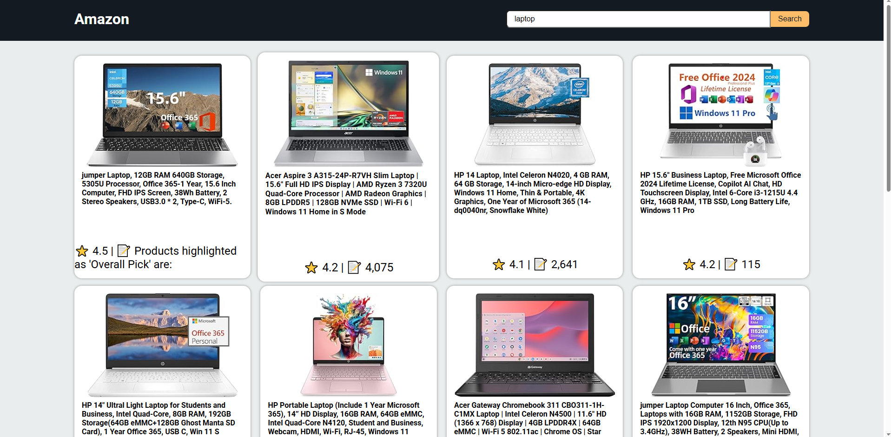

  
  
  <h1>Amazon scraper</h1>

 

 🔗Content
   <ol>
      <a href="#tecs">Tecnologies</a>
      <a href="#about">About</a>
      <a href="#howto">how to use</a>
      <a href="#author">Author</a>
   </ol>

<h2 id="tecs">💻 Tecnologies</h2>

  
  
  
  
  

<h2 id="about">🔍 About</h2>

Projeto realizado para portfólio próprio, onde me apresento e mostro mais dos meus conhecimentos

O projeto consiste em uma página dedicada a mim e às minhas habilidades. Nela, apresento várias informações e seções, incluindo uma biografia, uma descrição detalhada das minhas competências, os serviços que ofereço, exemplos de projetos realizados, uma seção para contato e um rodapé informativo. O site é enriquecido com diversas animações em CSS e interações dinâmicas com JavaScript, proporcionando uma experiência envolvente e interativa para os visitantes.

Este projeto foi uma excelente oportunidade para praticar e aprimorar minhas habilidades em JavaScript, já que é meu primeiro projeto desse estilo. O site possui diversas animações e interações, incluindo animações em botões, imagens, textos e projetos. Também implementei um modo escuro (dark mode), um slider, menus dropdown, manipulação de modais e um formulário de email integrado com o Formsubmit, que redireciona para uma página de agradecimento (thankspage). Além disso, o site conta com botões de links diretos para meu currículo, LinkedIn, GitHub, Instagram e uma opção de conversa no WhatsApp, proporcionando uma experiência de usuário dinâmica e envolvente. Espero que aproveite a visita!.

<a href="https://portifolio-vinicius-mello.vercel.app/">Link do projeto</a>

<a href="#home">⬆️</a>

<h2 id="howto">⚒ Como usar</h2>

Projeto com diversas interações e animações para deixar uma ótima experiência!.

<ul>
  <li>★ No cabeçalho, escolha a seção que deseja visualizar, ou se deseja Dark mode ativado</li>
  <li>★ Na home, pode clicar no Curriculo para visualizar outra pagina, também tem links para Github, Linkedin e Instagram</li>
  <li>★ Em Sobre mim, pode ver informçaões sobre minha tagetória até aqui no slider, e sobre mim</li>
  <li>★ Nas habilidades, apenas clique no titulo que deseja ver ou desver as Tecnologias que tenho conhecimento em usar</li>
  <li>★ Nos serviços, basta clicar no card que deseja ver mais informações sobre o que eu sei fazer na area em especifico</li>
  <li>★ Em projetos, basta passar o mouse por cima para visualizar mais informações sobre aquele projeto, com links para o website e/ou para o repositório</li>
  <li>★ Em contate-me, basta clicar no botao do meu numero que sera redirecionado para uma conversa comigo, ou enviar um email atraz do formulário</li>
  <li>★ No rodapé, é possivel ver links para as seções, mais projetos e redes sociais</li>

</ul>

<a href="#home">⬆️</a>

<h2 id="author">👨🏽‍💼 Autor</h2>

Vinicius Feliciano Mello - viniciusfelicianomello@hotmail.com

<ul>
  <li><a href="https://www.linkedin.com/in/vinicius-feliciano-mello/">Linkedin</a></li>
  <li><a href="https://instagram.com/viinifeliciano">Instagram</a></li>
  <li><a href="https://github.com/ViniciusFelicianoMello">Github</a></li>
</ul>

<a href="#home">⬆️</a>

